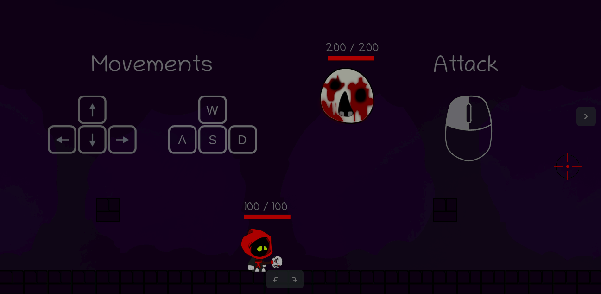
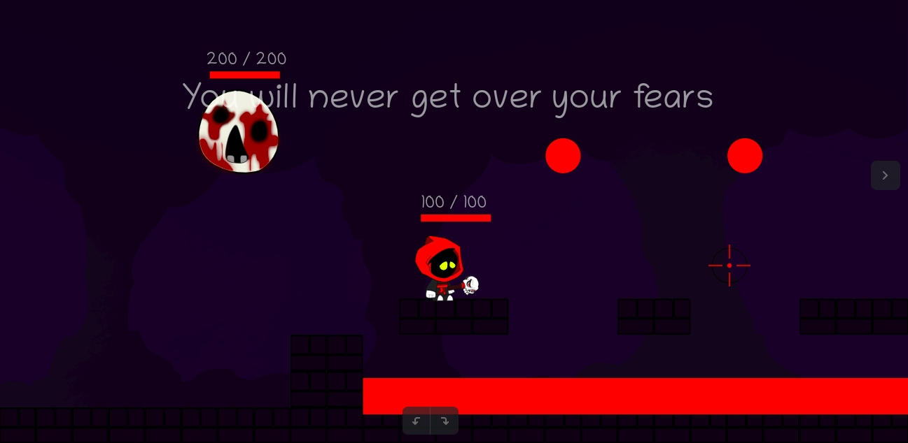
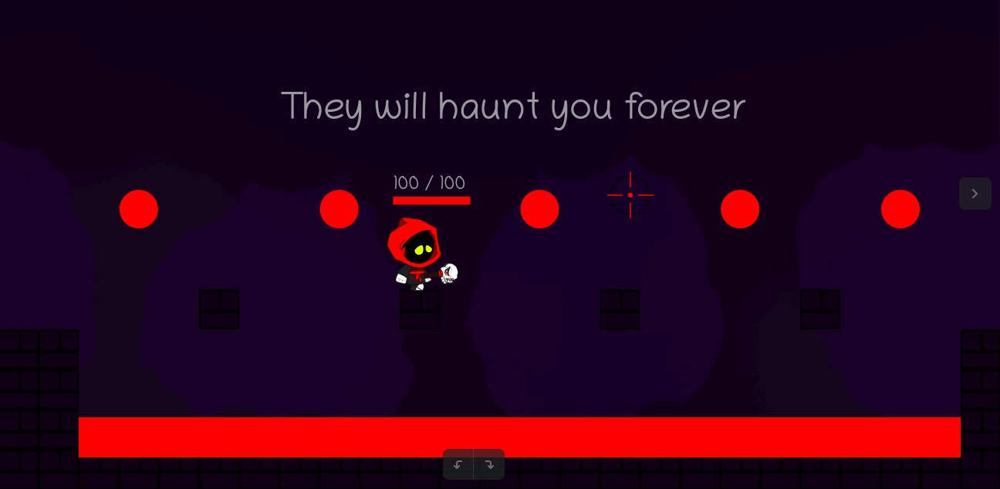
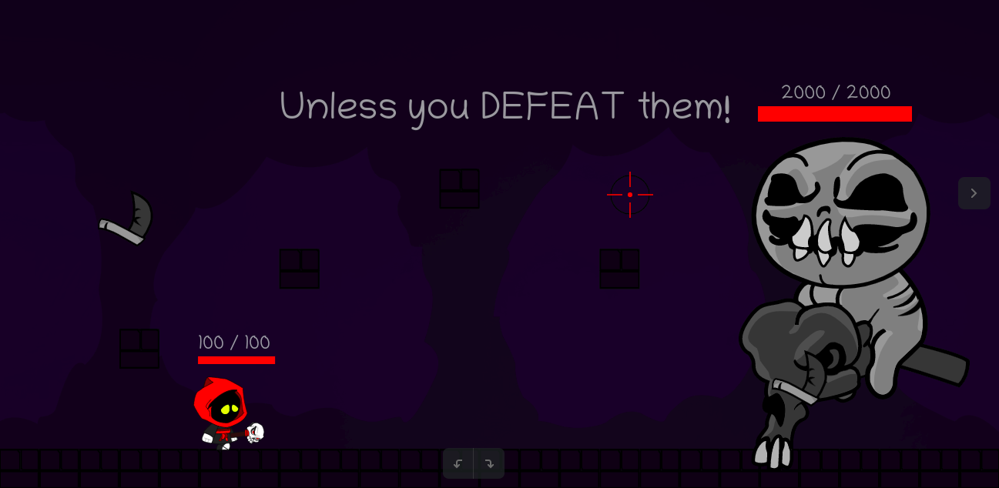

# Mad World - Facing your fears

> This game was developed using only HTML, CSS and JS within 7 days.

*In Mad World you play as a little guy trying to overcome all his fears. Hope you enjoy it :)*

## Installation

Clone or download this project, open the index.html file in your browser and have Fun. Or just click in this [link](https://adamy96.github.io/mad_world/)!

## Usage

How to play:
* Press 'A' or left arrow to move left
* Press 'D' or right arrow to move right
* Press 'W' or up arrow to jump
* Click the location that you wanna throw your amazing fireballs
* You can go to another map crossing the right border of the screen
* Try to avoid the red things, they hurt... a lot.
* The most important: have fun!

## Credits

Vincius Adamy - viniciusbohreradamy@gmail.com

The 'Chaser' monster and the first Boss are from a game called The Binding of Isaac.

[myGithub](https://github.com/Adamy96)
